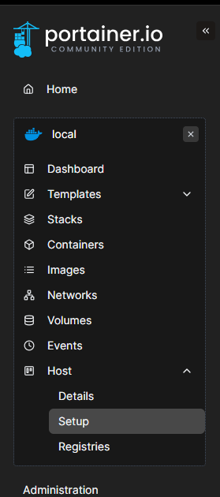
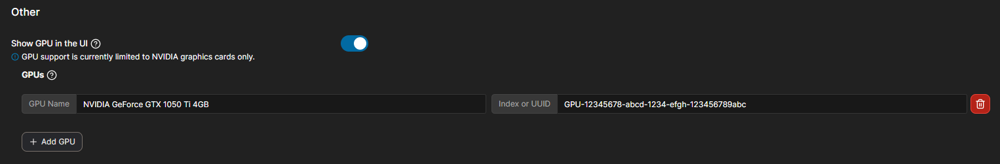
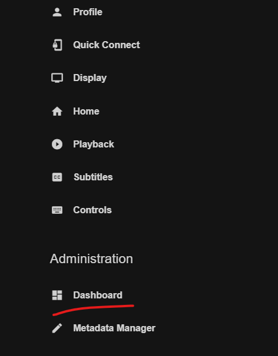
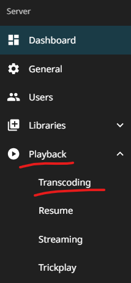
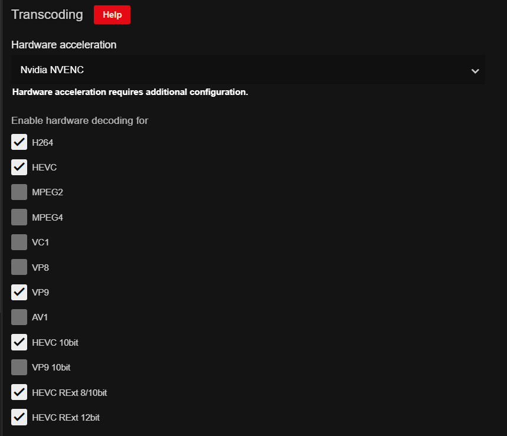

## A small intro, if you will
Jellyfin is great, on its own. Having the entirety of my media library presented and interacted with (Netflix-style) is amazing, and all of that without paying a subscription (like Plex) and being open source.

However, when you start involving different types of devices or/and people (where their devices do not support the codecs your media is encoded), this is where the problems start. By default, Jellyfin uses FFMPEG in Software mode, in order to transcode your media into a codec usable by the viewer's device at that time. This is fine, if you have a beefy CPU or your server is not being used by multiple people at a time. However, if you are using the server for other things, this CAN take away resources from them, or worse, bring down the entire system to its knees, making it unusable.

Since I made and let my Jellyfin server be handled by CasaOS's Docker Management Dashboard (it's still a great option for set and forget scenarios), I have reached the conclusion (as time passed with me trying to make HW Acceleration work) that making the docker container again in Portainer was not only necessary, but painless to work with afterwards (and somehow running a bit more efficiently?)

For my approach of adding support for Hardware Acceleration in my Jellyfin server, I will be using an Ubuntu Server (24.04) system with a NVIDIA GTX 1050 Ti, as it supports the codecs that my media library is currently encoded at.

---

## 1. Preparing the NVIDIA GPU
Ubuntu (my server distro of choice) has a CLI tool ([ubuntu-drivers](https://ubuntu.com/server/docs/nvidia-drivers-installation)) that picks up the supported driver versions for the system:

```sudo ubuntu-drivers --gpgpu list```

a. Install the latest driver version with: ``sudo ubuntu-drivers install``

b. After that, run `nvidia-smi` on the terminal. It should look like this:
	```
	+-----------------------------------------------------------------------------------------+
	| NVIDIA-SMI 550.120                Driver Version: 550.120        CUDA Version: 12.4     |
	|-----------------------------------------+------------------------+----------------------+
	| GPU  Name                 Persistence-M | Bus-Id          Disp.A | Volatile Uncorr. ECC |
	| Fan  Temp   Perf          Pwr:Usage/Cap |           Memory-Usage | GPU-Util  Compute M. |
	|                                         |                        |               MIG M. |
	|=========================================+========================+======================|
	|   0  NVIDIA GeForce GTX 1050 Ti     Off |   00000000:01:00.0 Off |                  N/A |
	| 40%   22C    P8             N/A /   75W |       2MiB /   4096MiB |      0%      Default |
	|                                         |                        |                  N/A |
	+-----------------------------------------+------------------------+----------------------+
																																													
	+-----------------------------------------------------------------------------------------+
	| Processes:                                                                              |
	|  GPU   GI   CI        PID   Type   Process name                              GPU Memory |
	|        ID   ID                                                               Usage      |
	|=========================================================================================|
	|  No running processes found                                                             |
	+-----------------------------------------------------------------------------------------+
	```
c. Now is the time for us to get the GPU's UUID, which is how we will pass the GPU to the Docker container. Run the following command:

```
$ nvidia-smi -L

GPU 0: GeForce GTX 1050 Ti (UUID: GPU-12345678-abcd-1234-efgh-123456789abc)
```

Copy the UUID and save it somewhere temporarily.

## 2. Preparing the Docker Environment
For Docker container management, Portainer will be used here, since it makes the job of GPU handling a lot easier.

I will not be covering the installation of either Docker or Portainer, since the instructions from both projects are easy enough to follow on their own.

- [Docker Installation Guide](https://docs.docker.com/engine/install/ubuntu/)
- [Portainer Installation Guide](https://docs.portainer.io/start/install-ce/server/docker/linux#introduction)

---

a. Simply visit the Portainer panel (unless you chose another port, [the documentation uses the 9443 port](http://IPADDRESS:9443)) and make an account:

b. Go to Host -> Setup

  

c. Toggle 'Show GPU in the UI' on, press 'Add GPU', name it whatever you want and paste the UUID you copied earlier. It should look like this:

  

d. Click on 'Save configuration'.

## 3. Creating the Jellyfin Container
a. Click on the "Stacks" tab on the left sidebar.
b. Click on the "Add stack" button.
c. Name the stack `jellyfin` (or whatever you want).
d. Paste the following code in the editor:

``` yaml
services:
  jellyfin:
    image: linuxserver/jellyfin:latest
    container_name: jellyfin
    privileged: true
    environment:
      - PUID=1000
      - PGID=1000
      - TZ=YourTimeZone
      - NVIDIA_VISIBLE_DEVICES=all
      - NVIDIA_DRIVER_CAPABILITIES=all
      - CPU_FALLBACK true
    volumes:
      - /yourdirectory/jellyfin/config:/config
      - /yourmedia:/Media
      - /opt/vc/lib:/opt/vc/lib
      - /dev:/dev
      - /nvidia-caps:/nvidia-caps
    ports:
      - 8096:8096
      - 8921:8920
      - 7359:7359
      - 1901:1900
    restart: unless-stopped
    group_add:
      - "993"
    deploy:
      resources:
        reservations:
          devices:
            - driver: nvidia
              count: all
              capabilities: [gpu]
```

Save it and deploy the stack.

## 4. Configuring Jellyfin

a. Go to the Jellyfin web interface (http://IPADDRESS:8096) and login with your credentials.
b. Go to the Admin Dashboard (Top left user icon) -> (Under Administration) Dashboard -> Playback -> Transcoding.






c. On the Hardware Acceleration section, select "NVIDIA NVDEC" as the hardware acceleration method. And, depending on your GPU, you can select the appropriate codecs.



d. Scroll down, save the changes and restart the Jellyfin server.