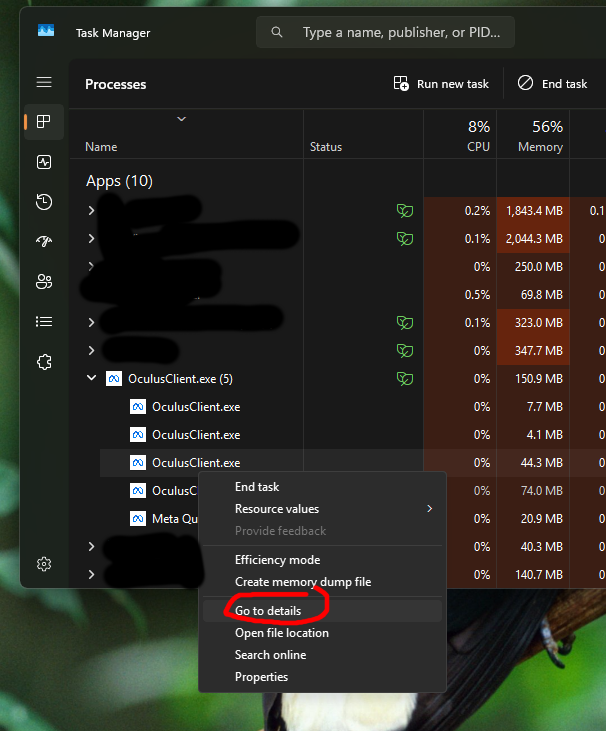
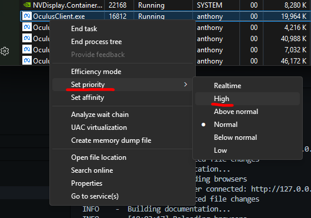
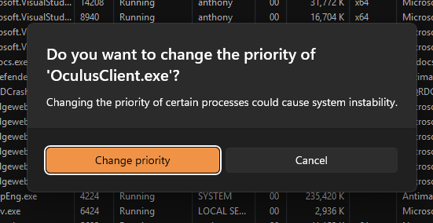

## Playing PCVR games

### Changing Quest Link app's process priority
To improve performance, you can change the process priority of the Quest Link app to "High" in Windows Task Manager. This can help ensure that the app gets more CPU resources, which is sometimes the root cause of performance issues in PCVR games, even if the game is running smoothly on the PC.

1. Open the Task Manager by pressing `Ctrl + Shift + Esc`.
2. Find the Quest Link app in the list of processes.
3. Right-click on the Quest Link app (QuestClient.exe) and select "Go to details".

4. Right-click on the highlighted process and select "Set priority" > "High".

5. Confirm the change if prompted.

