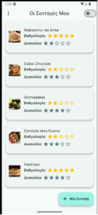
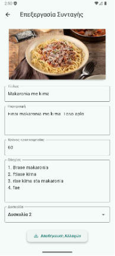

---
hide:
  - revision_date
  - revision_history
---

# 🍳 Recipe Manager App

* **Type**: Mobile Application (Cross-Platform)
* **Status**: Finished
* **Tech Stack**: Flutter, Dart
* **Repository**: [View Source Code on GitHub](https://github.com/antv199/Flutter-Cooking-App)

---

## 📱 Project Overview

This application is a personal digital cookbook designed for mobile devices. It allows users to organize their cooking recipes with an emphasis on ease of use and offline accessibility.

The app compiles natively to Android, offering high performance and a smooth user experience without requiring an active internet connection.

---

## 👥 Team

* **Antonios Vatousis**: Mobile Development & Logic Implementation
* **[Athanasios Fotopoulos](https://www.linkedin.com/in/thanos-fotopoulos-832438344/)**: Mobile Development & UI Design

---

## 🛠️ Key Features

### 1. Full Recipe Management
Users can seamlessly **Create** new recipes with photos, **Edit** existing details (ingredients, steps), and **Delete** entries they no longer need.

### 2. Dynamic Sorting & Filtering
The app includes logic to sort the recipe list instantly based on:

* **Difficulty Level** (Stars)
* **User Rating**
* **Preparation Time**

### 3. Dark & Light Mode
Implemented a global theme state that switches the entire app's color palette between Light and Dark modes based on user preference.

### 4. Interactive Rating System
A custom widget implementation allowing users to rate recipes on a 5-star scale.