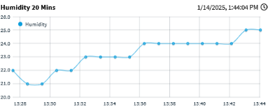
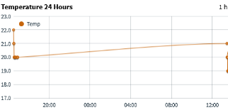
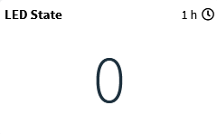
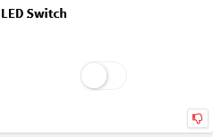
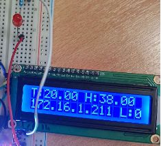

---
hide:
  - revision_date
  - revision_history
---

# 🌡️ IoT Environmental Monitor

* **Type**: Embedded System / IoT
* **Hardware**: ESP32, DHT11, LCD I2C
* **Platform**: Thinger.io Cloud
* **Language**: C++ (Arduino)
* **Repository**: [View Source Code on GitHub](https://github.com/antv199/esp32-enviroment-monitor)

---

## 📡 Project Overview

This project is a complete IoT solution for monitoring environmental conditions (Temperature & Humidity) in real-time. It bridges the physical world with the cloud, allowing for remote data visualization and control.

The system is built around the **ESP32** microcontroller, which collects sensor data, processes it locally, and transmits it via Wi-Fi to the **Thinger.io** platform.

---

## 👥 Team

* **Antonios Vatousis**: Software & Cloud Implementation (C++, Thinger.io config)
* **[Nikolaos Giatras](https://www.linkedin.com/in/nikos-giatras-893344367/)**: Hardware Assembly & Circuit Design

---

## 🛠️ Key Features

### 1. Real-Time Cloud Dashboard
Data is streamed instantly to a custom dashboard on Thinger.io, featuring gauges for current values and line charts for historical analysis (24h Temperature, 20min Humidity).





### 2. Edge Computing
Instead of just sending raw data, the ESP32 performs local calculations, such as computing the **5-minute rolling average temperature** to smooth out sensor noise before uploading.

### 3. Bi-Directional Control
The communication isn't just one-way. The system supports remote commands, allowing users to toggle a status LED on the device directly from the web dashboard.





### 4. Local Feedback
An I2C LCD display provides immediate feedback on-site, showing:

* Current Temperature & Humidity
* Device IP Address (for debugging)
* Connection Status



---

## 💻 Code Logic

The firmware handles connection stability and data rate limits (2-second interval) to comply with API constraints.

```cpp
// Example of the logic loop
if (tempCount >= 150) {
    temp5mins = tempSum / tempCount;
    // Transmit average to cloud...
    tempSum = 0;
    tempCount = 0;
}
```