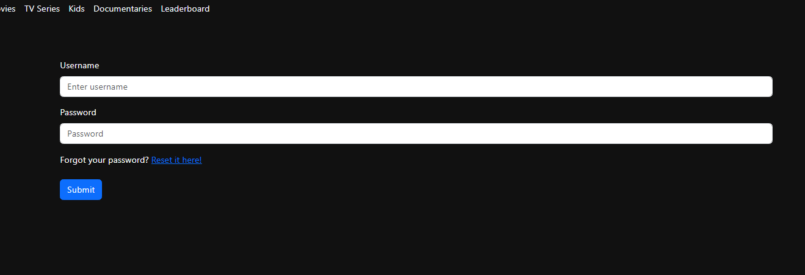
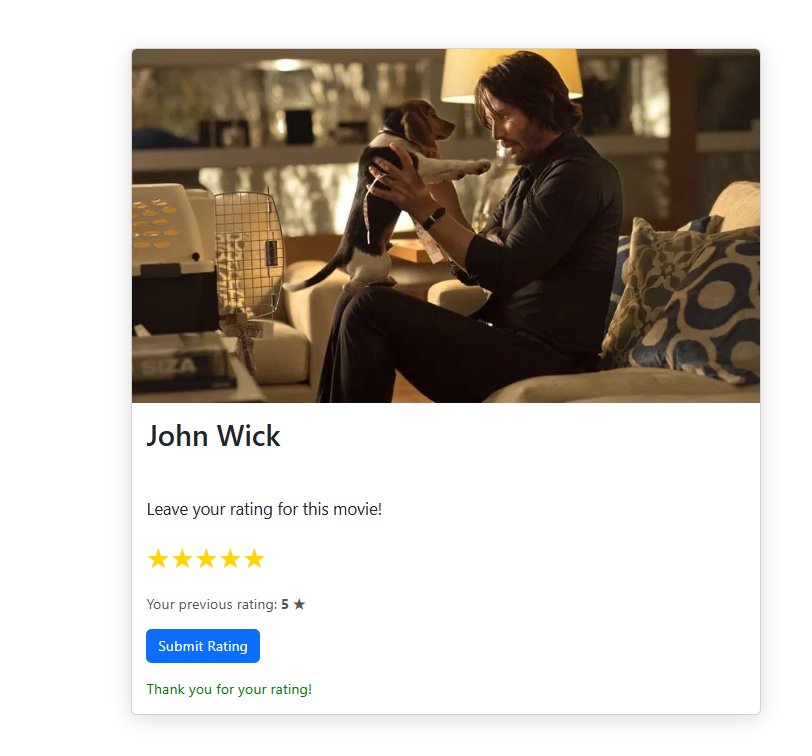
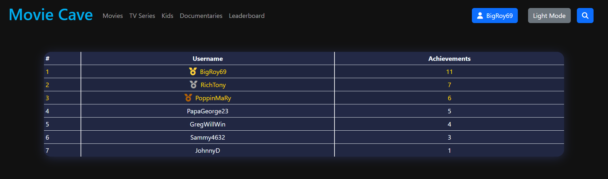

---
hide:
    - revision_date
    - revision_history
---

# Movie Tracking Website

* **Status**: Finished
* **Year**: 2025
* **Link**: [GitHub Repository](https://github.com/KostasNikolaou23/Website-Project)

## About
As part of a university assignment, this project is a website for tracking movies and TV series. Users can create personal watchlists, rate and review content, and receive personalized recommendations.

The platform features gamification elements such as badges, achievements, and leaderboards, as well as interface customization options like dark/light mode.

Built with React.js, Node.js, Express.js, and MySQL/MariaDB, it offers secure user authentication, viewing statistics, and graphical analytics to enhance the user experience.

## Roles
* [Konstantinos Nikolaou](https://www.linkedin.com/in/konstantinos-nikolaou-975aa62b0/): Frontend
* Me: Backend, Database Design

## Technologies Used

### Frontend
* React.js
* Bootstrap (for quick UI development)
* Chart.js (for analytics)

### Backend
* Node.js
* Express.js
* CryptoJS (for password hashing)

### Database
* MySQL/MariaDB

### Movie/Series Data
* TMDB API (The Movie Database)

## Features
* **User Authentication**: Secure login and registration with password hashing.

* **Watchlist Management**: Users can add, remove, and manage their watchlists.

* **Rating and Reviews**: Users can rate movies/series and write reviews.

* **Personalized Recommendations**: Based on user preferences and watch history.

* **Gamification**: Badges, achievements, and leaderboards to encourage engagement.

